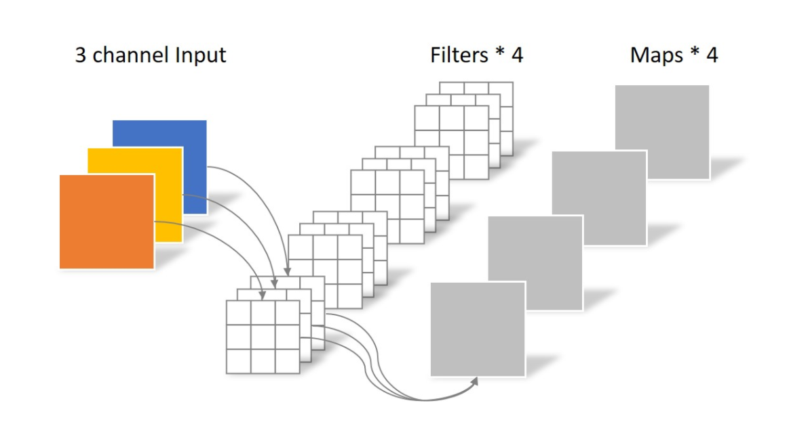
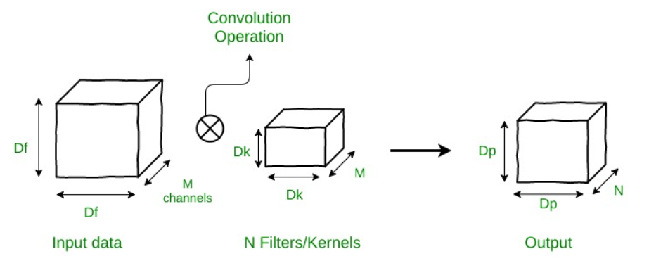
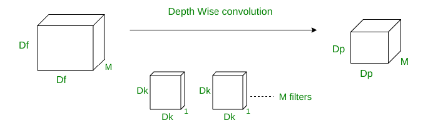
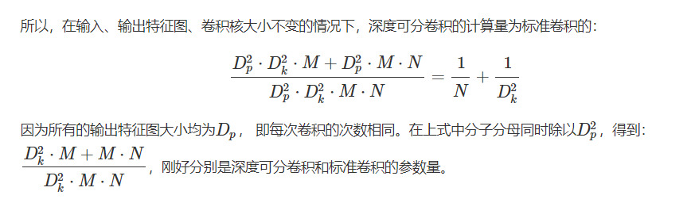
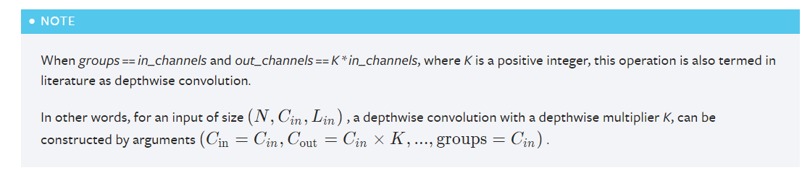

从QAnet中了解到 Depthwise Separable Convolution

分为两步 一是 Depthwise, 二是 Separable

QAnet提到，使用Depthwise Separable Convolution的好处是
1. 更轻量，更快
2. 更好泛化
   
更好泛化 是因为 group 之后 相当于很多权重变为0

## 分析
先看普通的CNN，如果输入层是一个 64*64 像素，三通道的彩色图片。经过一个包含 4 个filter的卷积层，
最终输出 4 个 Feature map，再same padding 的作用下，Feature map的尺寸可以与输入层相同。

整个过程如下图所示：
  

Depthwise Separable Convolution 是将一个完整的卷积运算分为两步进行。
1. Depthwise Convolution
2. Pointwise Convolution

先看Depthwise Convolution

Depthwise Convolution 的一个 卷积核 负责一个通道。也就是 (3\*3\*3) -> (3*3),一个通道只被一个卷积核卷积。
如下图所示：

  

Depthwise Convolution 完成后的 Feature map 数量与输入层的 depth 相同，但是这种运算对每个
channel 独立进行卷积运算后 就结束了。并没有有效利用 **不同map**  在 **相同空间位置** 上的信息。

因此，需要增加一个操作来将这些map进行组合，生成新的 Feature map。接下来是Pointwise Convolution.

再看 Pointwise Convolution

Pointwise Convolution 的运算与普通卷积一样，区别是他的卷积核是 (1, 1, M) M就是 Depthwise Convolution输出的
的通道数。

所以这里的卷积运算会将上一步的 map 在深度方向上进行加权求和，生成新的Feature map。

有几个 (1, 1, M) 的卷积核，就有几个输出的 Feature map。

如下图：

  

总结一下：
depthwise separable convolution 与 常规卷积的区别是：

常规卷积中 每个卷积核是同时操作 输入的每个通道

DSC 中 分为两步

1. 首先，使用 depthwise 对卷积进行深度分离。一个通道只被一个卷积核占据。这样的缺点是没有有效利用不同通道
在相同空间位置上的feature信息。
2. 鉴于上述缺点，使用 pointwise convolution 实现特征图维度扩展。

## 计算量分析

标准卷积如下图所示：

  

因为输出特征图中的每一层的每个像素都是一次卷积结果。
所以，

每次卷积的计算量为: Dk^2 * M

每个卷积核的计算量为: Dp^2 * (Dk^2 * M)

一共N和卷积核，所以总计算量为: N * (Dp^2 * Dk^2 * M)

下边看DSC的计算量，先看 Depthwise 卷积的计算量

如下图，Depthwise 的计算量为:
Dp^2 * (Dk^2 * M)
  

再看，Pointwise卷积的计算量为:Dp^2 * M * N

分析：
  

## 实现
下边就是代码部分，Pytorch中 torch.nn.Conv1d()的参数 group=in_channels,表示depthwise convolution
  
且 groups的值，必须能被 in_channels 整除。这好理解，要不没办法分配啊。

首先要理解 group 什么意思。

总结代码

参考：
1. [Group Convolution分组卷积，以及Depthwise Convolution和Global Depthwise Convolution](https://www.cnblogs.com/shine-lee/p/10243114.html)
2. [什么是depthwise separable convolutions](https://blog.csdn.net/qq_22764813/article/details/97798978)
3. [深度可分卷积（Depthwise Separable Conv.）计算量分析](https://www.cnblogs.com/southtonorth/p/10675688.html)