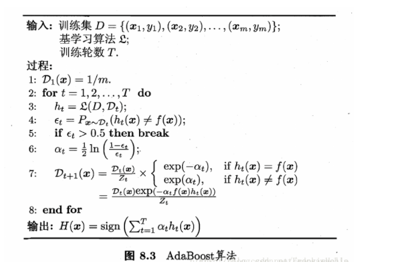
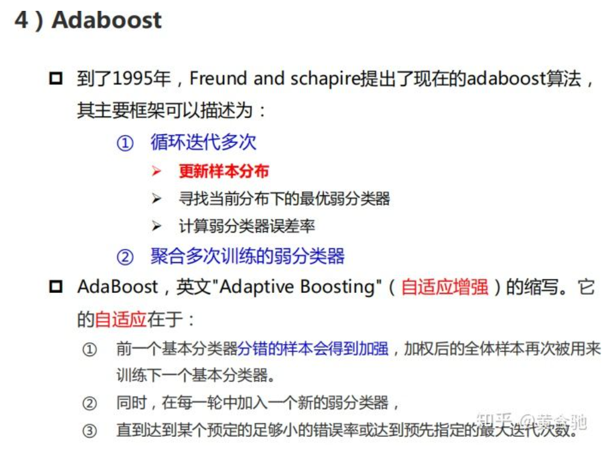
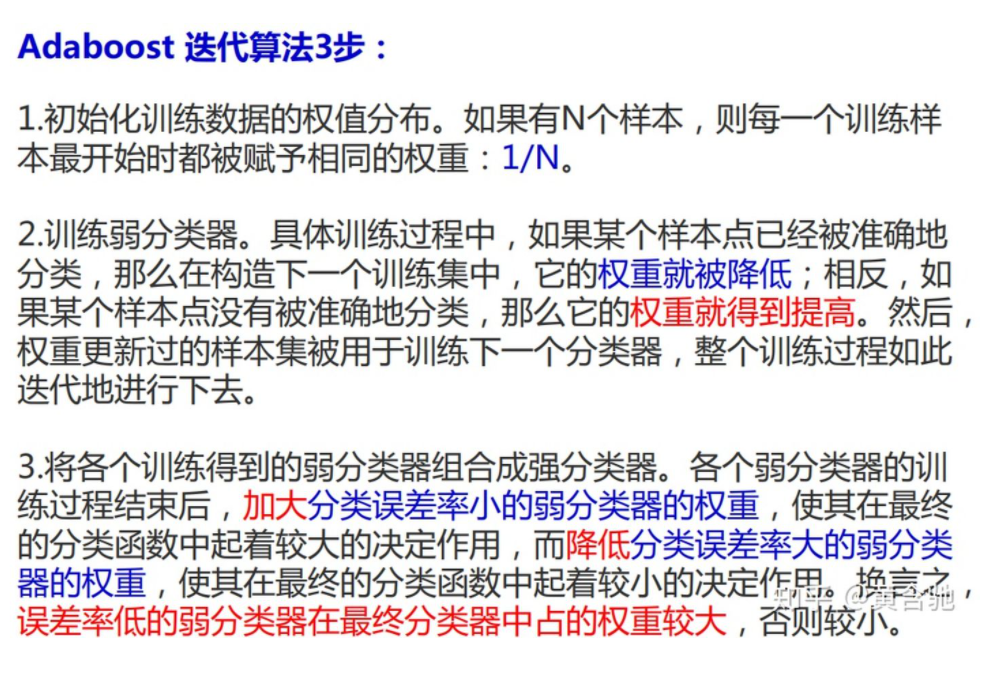
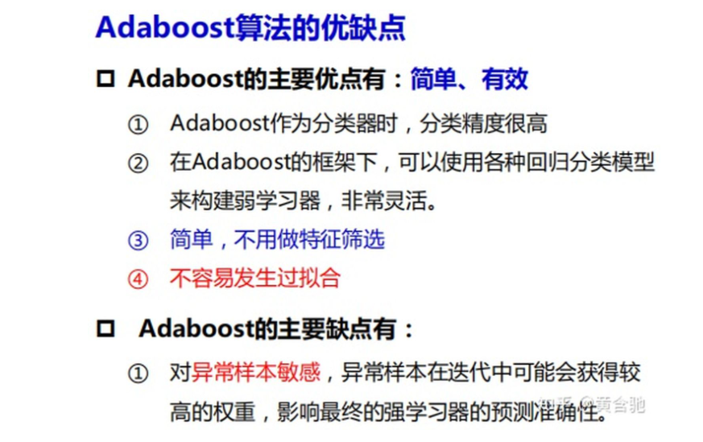

bagging boosting 
blending stacking

bagging/boosting强调**抽取数据的策略**，两者都采取随机有放回取样，不同的是
bagging中，所有数据被抽到的概率相同，而在Boosting中，每一轮被错误标记的数据
会被增加权重，从而增加在下一轮学习中被抽到的概率。


blending/stacking其实是同一个概念，强调**集成弱学习器输出的策略**。在stacking中
所有弱学习器被称作0级学习器，他们的输出结果紧接着被输入进一个1级学习器（元学习器），
然后由元学习器输出最后的策略。

## bagging
Bagging是Bootstrap Aggregating的缩写。Bagging是为了得到泛化能力强的集成，因而就需要让各个子学习器之间尽可能独立，但是如果将样本分为了不同的不重合子集，那么每个基学习器学习的样本就会不足。所以它采用一种自助采样的方法（boostrap sampling）每次从数据集中随机选择一个subset，然后放回初始数据集，下次取时，该样本仍然有一定概率取到。然后根据对每个subset训练出一个基学习器，然后将这些基学习器进行结合。对于分类任务可以通过vote来输出结果，回归任务可以求平均值。Bagging的代表是Random Forest，RF是在决策树作为基学习器通过Bagging思想建立的。


## boosting
Boosting是一种将弱学习器转换为强学习器的算法，它的机制是：先从初始训练集训练出一个基学习器，然后根据基学习器的表现对训练样本进行调整，使得先前基学习器做错的训练样本在后续的训练中得到更多的关注，然后基于调整后的样本分布来训练下一个基学习器。Boosting的代表是Adam Boosting。

  

如果把Bagging看作是多个基分类器的线性组合，那么Stacking就是多个基分类器的非线性组合。Stacking可以很灵活，它可以将学习器一层一层地堆砌起来。


blending和stacking类似，主要是对已学习好的基学习器的融合的不同，blending是线性融合，
而stacking是非线性融合。

blending只使用了一部分数据集作为留出集进行验证，而stacking使用多折交叉验证。比使用单一留出集更稳定

Blending与Stacking大致相同，只是Blending的主要区别在于训练集不是通过K-Fold的CV策略来获得预测值从而生成第二阶段模型的特征，而是建立一个Holdout集。简单来说，Blending直接用不相交的数据集用于不同层的训练。

## adaboost

每一轮的时候，通过重新的每个example不一样的权重。宗旨是放大错误样本，缩小正确样本。
把错误的example权重提高，来得到不一样的g。并且在每次迭代的时候，根据错误值e的大小，给予g不同的权重。最后把这些g整合起来，
就得到adaboost。

  
  
  


### bagging和boosting区别
1. 样本选择：Bagging算法是有放回的随机采样；Boosting算法是每一轮训练集不变，只是训练集中的每个样例在分类器中的权重发生变化，而权重根据
上一轮的分类结果进行调整。
2. 样例权重：Bagging使用随机抽样，样例的权重，Boosting根据错误率不断地调整样例的权重值，错误率越大则权重越大。
3. 预测函数：Bagging所有预测模型的权重相等，Boosting算法对于误差小的分类器具有更大的权重。
4. 并行计算：Bagging算法可以并行生成各个基模型，Boosting理论上只能顺序生产，因为后一个模型需要前一个模型的结果。
5. Bagging是减少模型的variance（方差），Boosting是减少模型的Bias（偏移）
6. Bagging里每个分类模型都是强分类器，因为降低的是方差，方差过高需要降低的是过拟合。
7. Boosting里每个分类模型都是弱分类器，因为降低的是偏度，偏度过高是欠拟合。

随机森林是一个Bagging方法，Bagging是一种有放回抽样方法：取出一个样本加入训练集，然后再把该样本放回原始样本空间，以使下次取样本依然能取到该样本。使用这种方式，可以取样出T个包含m个样本的训练集，并且每个训练集都不一样。随机森林在Bagging的基础上，进一步在决策树的训练过程中引入了一些随机性：在决定划分属性的时候，先随机选择一个包含k个属性的子集，然后再从子集中选择一个最优属性进行划分，这也是随机的内涵。

RF将bagging与decision tree结合起来， 通过把众多的决策树组进行组合，构成森林的形式，利用投票机制让G表现最佳，分类模型更稳定。其中为了让decision tree的随机性更强一些，可以采用randomly projected subspaces操作，即将不同的features线性组合起来，从而进行各式各样的切割。同时，我们也介绍了可以使用OOB样本来进行self­-validation，然后可以使用 self­-validation来对每个特征进行permutaion test，得到不同特征的重要性，从而进行 feature selection。总的来说，RF算法能够得到比较平滑的边界，稳定性强，前提是有足够多的树。

为什么boosting减小bias，bagging减小variance？？？


### stacking
Stacking是指训练一个模型用于组合（combine）其他模型（基模型，基学习器）的技术。
即首先训练出多个不同的模型，然后再以之前训练的各个模型的输出作为输入来新训练一个新的模型，从而得到一个最终的模型。
一般情况下使用单层Logistic回归作为组合模型。

blending stacking

stacking是一种分层模型集成框架。以两层为例，第一层有多个基学习器组成,其输入为原始训练集，
第二层模型则是以第一层学习期的输出作为特征加入训练集进行再训练，从而得到完整的stacking模型。


blending stacking比较：
blending比stacking简单，不使用k折交叉验证来获得stacker feature，避开了一些信息泄露的问题。？？
因为generlizers和stacker使用了不一样的数据集

stacking代码
```python
TrainingData = train.shape[0]
TestData = test.shape[0]

#5折
kf = KFold(nsplits=5, random_state=2017)

def get_oof(clf, x_train, y_train, x_test):

    #oof_train对应于训练数据集TrainingData
    oof_train = np.zeros((TrainData, ))

    #oof_test对应于测试集TestData
    oof_test = np.zeros((TestData, ))

    #oof_test_skf对应于5折之后的所有predict作为新的TestData,
    #只要最后对行(axis=0)取平均就得到平均predict值TestData
    oof_test_skf = np.empty((5, TestData))

    for i, (train_index, test_index) in enumerate(kf.split(x_train)):

        #kf_x_train 表示train data每一折中用于训练的 训练集
        kf_x_train = x_train[train_index]
        kf_y_train = y_train[train_index]

        kf_x_test = x_train[test_index]

        clf.train(kf_x_train, kf_y_train)

        oof_train[test_index] = clf.predict(kf_x_test)

        oof_test_skf[i, :] = clf.predict(x_test)

    oof_test[:] = oof_test_skf.mean(axis=0)

    return oof_train.reshape(-1, 1), oof_test.reshape(-1, 1)

```


参考：
[林轩田机器学习 | 机器学习技法课程笔记8 --- Adaptive Boosting](https://blog.csdn.net/sdu_hao/article/details/103764654)
[集成学习中bagging,boosting,blending,stacking这几个概念的区别是什么？](https://www.zhihu.com/question/63836832)
[N折交叉验证的作用（如何使用交叉验证）](https://zhuanlan.zhihu.com/p/113623623)