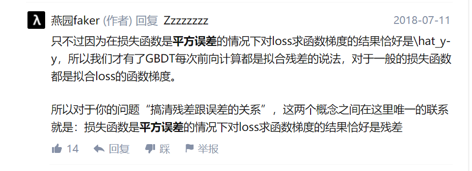
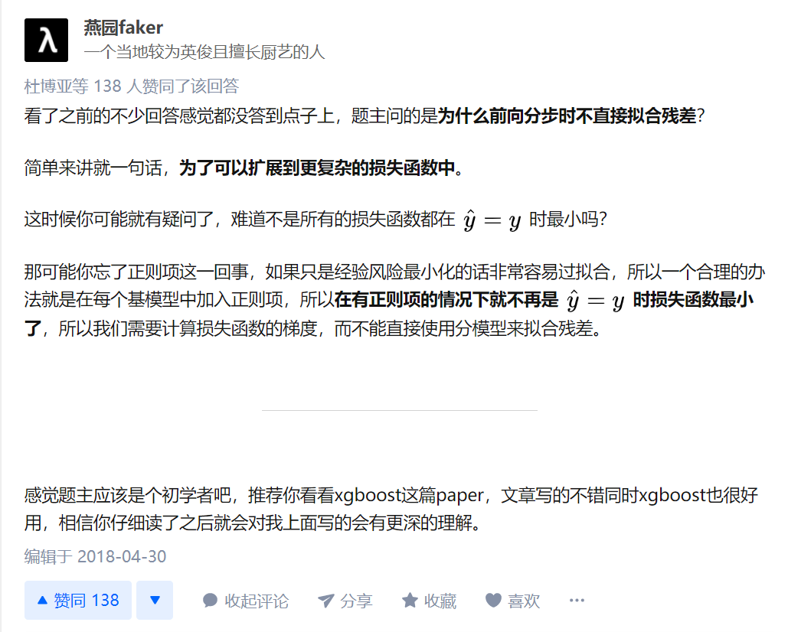

  

  

无论损失函数是什么形式，每个决策树拟合的都是负梯度。准确的说，不是用负梯度代替残差，而是当损失函数是均方损失时，负梯度刚好是残差，残差只是特例。

参考：

1. [gbdt的残差为什么用负梯度代替？](https://www.zhihu.com/question/63560633)
2. [梯度提升树中为什么说目标函数关于当前模型的负梯度是残差的近似值？](https://www.zhihu.com/question/60625492)