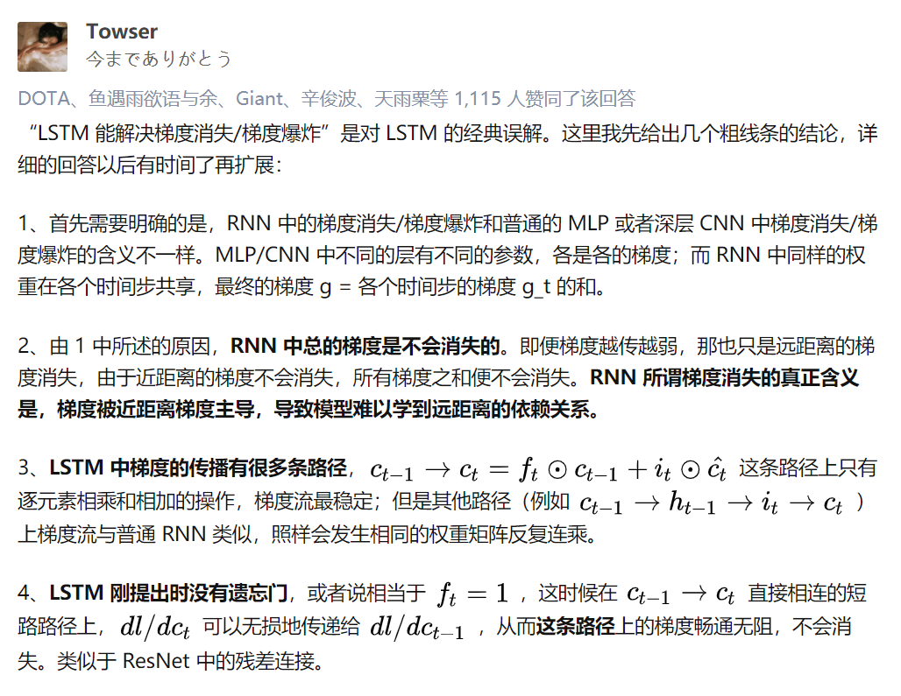
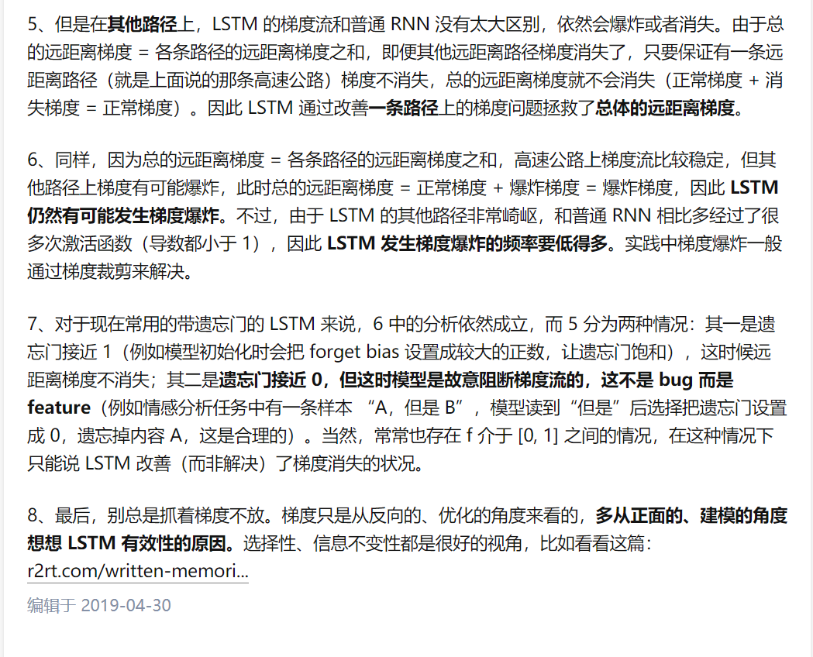

## question
lstm只是解决了长期依赖的问题吗，没解决梯度的问题吗？
长期依赖不就是梯度不消失吗

rnn不能捕捉远距离信息，是不是因为bptt，长距离的梯度衰减。近距离的梯度影响大于远距离的梯度。
梯度很小，模型就不能学习这种长距离依赖关系。
梯度消失，梯度爆炸是困扰rnn模型训练的重要原因之一，
产生梯度消失，梯度爆炸是因为rnn的权值矩阵循环相乘导致的，
相同的函数多次的组合会导致极端的非线性行为。
所以rnn很难在多个时间步上保存信息。
因为在普通rnn中，隐藏状态被不断重写。

处理梯度爆炸可以用梯度截断的方法。

lstm架构更容易保存许多时间步上的信息
如果忘记门设置为记得每一时间步上的所有信息，那么单元中的信息被无限保存
相比之下，普通rnn更难学习重复使用并且在隐藏状态中保存信息的矩阵
LSTM并不保证没有消失/爆炸梯度，但它确实为模型提供了一种更容易的方法来学习远程依赖关系

lstm如何解决梯度消失，梯度爆炸？
  
  

lstm三个门：
1. 输入门
2. 遗忘门
3. 输出门

recursive recurrent

rnn梯度消失
  
  

为什么梯度消失是一个问题：
  

参考
1. [07 Vanishing Gradients and Fancy RNNs](https://looperxx.github.io/CS224n-2019-07-Vanishing%20Gradients%20and%20Fancy%20RNNs/)
2. [LSTM如何来避免梯度弥散和梯度爆炸？](https://www.zhihu.com/question/34878706)
3. 