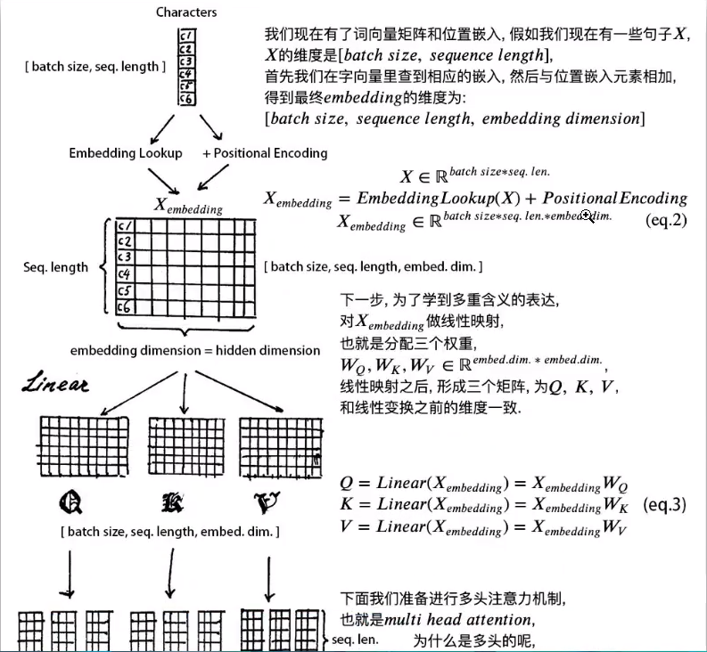
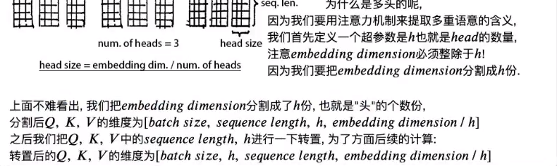

transformer是字作为输入 不是词？？
字 词？？

transformer的 位置编码是不训练的 bert的位置编码是训练的

## positional embedding 相关

参考：
1. [如何理解Transformer论文中的positional encoding，和三角函数有什么关系？](https://www.zhihu.com/question/347678607)
2. [Transformer使用position encoding会影响输入embedding的原特征吗？](https://www.zhihu.com/question/350116316)
3. 

$PE{(pos,2i)} = sin(pos / 10000^{2i/d_{\text{model}}}) \\ PE{(pos,2i+1)} = cos(pos / 10000^{2i/d_{\text{model}}})$

绝对位置编码，相对位置编码（三角函数编码）

代码：
1. transformer decoder 的input 是真实的 词 还是预测出来的词？
    还是训练的时候, decoder input 用真实的值 类似于 teacher foring
    测试的时候，用预测的值。

    s2s 的训练过程也是真实值作为 decoder 的输入吗

2. QK 的维度必须相等 V的维度可以和他们不等

3. 为什么 scaled dot product attention
4. 
