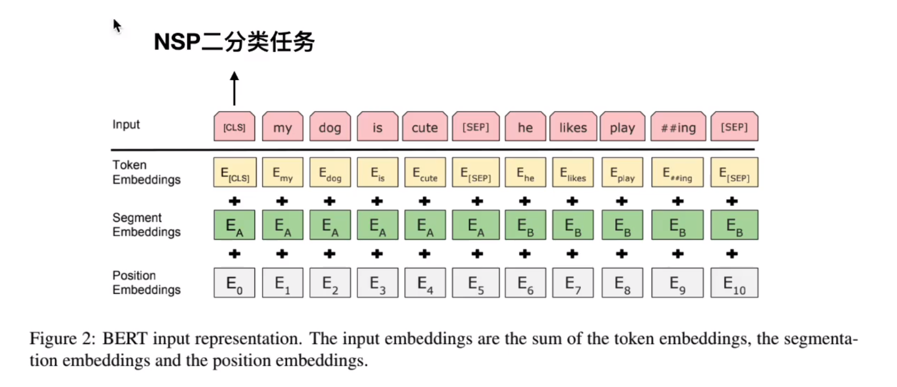
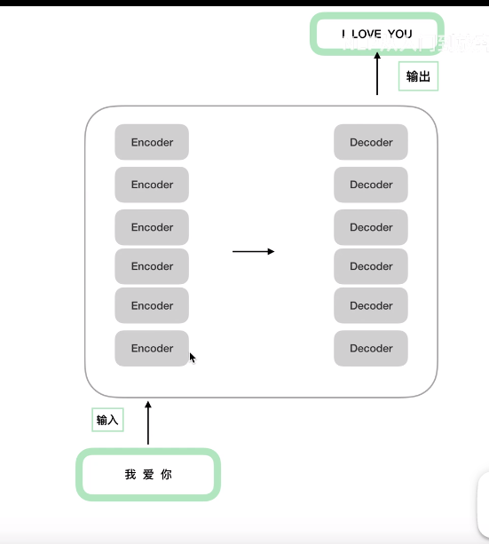
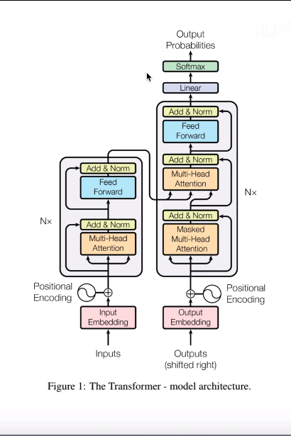
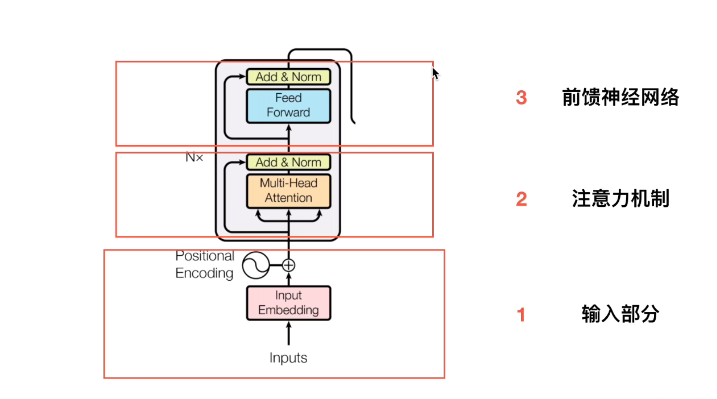
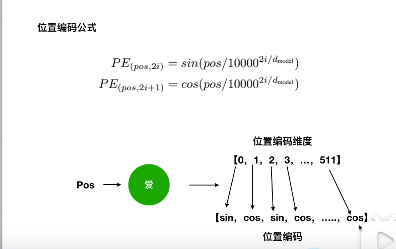
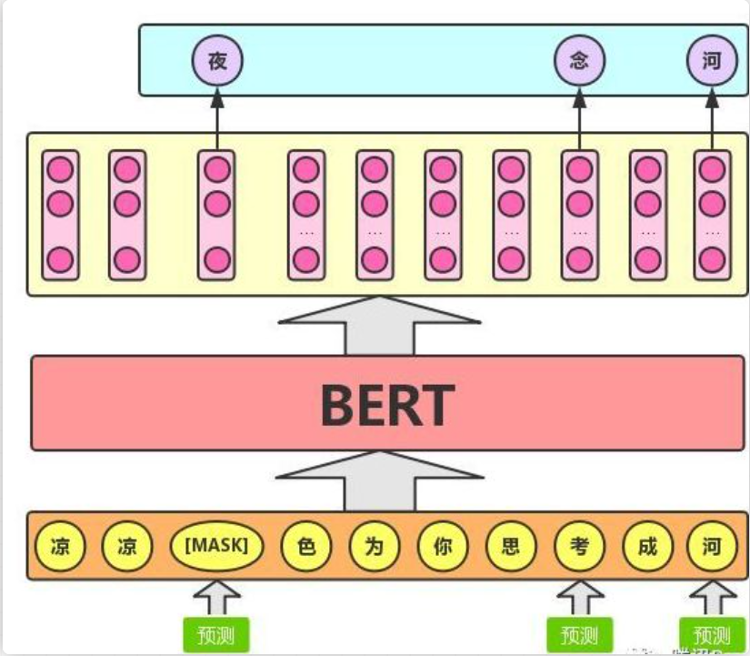

bert 使用的 transformer encoder 结构不一样吗

实际bert怎么用的

bert bpe
bert vocab.txt 没有的词

transformer源码 不同的QKV矩阵？

bert base12层encoder bert large 24层encoder
注意bert不是12个transformer堆叠的，是encoder堆叠的。
transformer是6个encoder组成的编码端，6个decoder组成了解码端。

bert是对字级别的，不是词级别的
### question
1. 为什么要mask，为什么80%概率 用[mask]来替换


### segment embeddings
需要注意的是，与Transformer本身的Encoder相比，BERT的Transformer Encoder端
输入的向量表示，多了Segment Embeddings。
Bert的输入由三部分组成。
Bert输入向量 = token_embedding + position_embedding + segment_embedding
  
为什么要加入 句子向量（segment embedding）:
因为bert会处理句子对分类，问答等任务。这里会出现句子对关系,而两个句子是有先后顺序关系的。
如果不考虑，就会出现词袋之类（武松打虎，虎打武松）的问题。因此bert加入了句子向量。
注意是position embedding 而不是 transformer的position encoding！！！


### NSP任务
处理两个句子的关系
sep的作用告诉模型，sep之前的是一个句子，sep之后的是另外一个句子。
bert pretrain模型直接拿来用作 sentence embedding 效果甚至不如word embedding，cls的embedding效果最差
（也就是你说的pooled output）。把所有普通token embedding做pool勉强能用（这个也是开源项目bert-as-service的默认做法），但也不会比word embedding好。
详情看NLP入门到放弃公众号。
无监督文本相似度？？苏建林bert白话

### bert position embedding 
随机初始化？让模型自己学？而不是用transformer的正余弦函数。

### bert 双向
因为bert采用的是transformer encoder层，encoder层将前后词都考虑进去。相对而言，gpt/gpt2采用类似于decoder层（？？），
是值考虑前面出现的词。因此gpt/gpt2采用的是单向语言模型


### 如何做训练MLM+NSP
MASK任务

BERT预训练的时候，使用的是大量的无标注的语料。
无监督目标函数：
AR（autogressive）自回归模型：只能考虑单侧信息：典型就是GPT
AE（autoencoding）自编码模型：从损坏的输入数据中预测重建原始数据。可以使用上下文的信息。BERT用的就是AE。
mask模型的缺点：优化目标：P(我爱吃饭|我爱maskmask) = P(吃|我爱)P(饭|我爱)
两个mask独立了

mask概率问题：
随机mask15%的单词：10%替换成其他，10%原地不动，10%替换成mask
mask代码实践
```python
for index in mask_indices:
    # 80% of the time, replace with [MASK]
    if random.random() < 0.8:
        masked_token = '[MASK]'
    else:
        # 10% if the time, keep original'
        if random.random() < 0.5:
            masked_token = tokens[index]
        else:
            masked_token = random.choice(vocab_list)
```

NSP任务
NSP样本如下：
1. 从训练语料库中取出两个连续的段落作为正样本。
2. 从不同的文档中随机创建一对段落作为负样本。
缺点：主题预测和连贯性预测合并为一个单项任务。


## 如何提升BERT下游任务效果
1. 获取预训练bert
2. 基于任务数据进行微调
先Domain transfer（大量微博文本） 再 Task transfer（微博情感文本） 最后 fine-tune（任务相关数据）性能是最好的

如何在相同领域数据中进行further pre-train
1. 动态mask：就是每次epoch去训练的时候mask，而不是一直使用同一个
2. n-gram mask：其实比如ernie和SpanBert都是类似于做了实体词的mask。

参数：
Batch_size: 16, 32 影响不太大
Learning rate(Adam): 5e-5, 3e-5, 2e-5
Number of epochs: 3, 4
Weighted decay修改后的adam，使用warm-up，搭配线性衰减

数据增强、自蒸馏、外部知识的融入

## transformer
  
注意encoder结构相同，但是参数是独立训练的。
  

encoder可以分为三个部分：输入+注意力机制+前馈神经网络
  

输入：embedding+位置嵌入
注意RNN的所有time stamp共用一套参数
RNN梯度消失？RNN的梯度是一个总的梯度和，它的梯度消失并不是变为0。而是总梯度被近距离梯度阻挡，被远距离梯度忽略不计。

偶数维度用cos，奇数维度用sin
  

引申为什么位置嵌入会有用
位置向量中蕴含了相对位置信息。
但是这种相对位置信息会在注意力机制那里消失。？？？

注意力机制
KV来自encoder，Q来自decoder


残差，LayerNorm
残差 梯度消失？

为什么使用Layer Normalizaion 不用 BN
BN效果差 BN不适合NLP


## Masked LM
  
bert模型的预训练过程其实就是模仿我们学习语言的过程。思想来源于【完形填空】的任务。
具体来说，文章作者在一句话中随机选择15%的词汇用于预测。对于在原句中被抹去的词汇，80%情况下
采用一个[MASK]替换，10%情况下采用任意一个词替换，剩下10%情况下保持原词不变。

这么做的主要原因是，在后续微调任务中语句并不会出现[MASK]标记，而且这么做的另外一个好处是：
预测一个词汇时，模型并不知道输入对应队尾的


bert是以字 不是词

## BERT的基本原理是什么
BERT是'Bidirectional Encoder Representations from Transformers'的缩写，整体是一个自编码语言模型（AutoEncoder LM）
并且设计了两个任务来预训练改模型。

* 第一个任务采用MaskLM的方式来训练语言模型，通俗的说就是在输入一句话的时候，


参考：
1. [史上最细节的自然语言处理NLP/Transformer/BERT/Attention面试问题与答案](https://zhuanlan.zhihu.com/p/348373259)
2. [Bert核心内容](https://blog.csdn.net/weixin_48185819/article/details/106535090)
3. [关于BERT，面试官们都怎么问](https://mp.weixin.qq.com/s/ao9-bn_2p0CrFUa_urtmOg)
4. 
