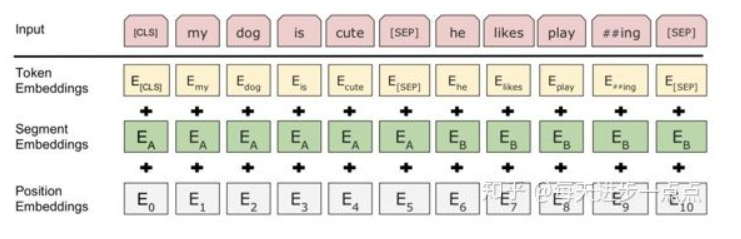

bert 使用的 transformer encoder 结构不一样吗

实际bert怎么用的

bert bpe
bert vocab.txt 没有的词

transformer源码 不同的QKV矩阵？

bert base12层encoder bert large 24层encoder
注意bert不是12个transformer堆叠的，是encoder堆叠的。
transformer是6个encoder组成的编码端，6个decoder组成了解码端。

### question
1. 为什么要mask，为什么80%概率 用[mask]来替换
2. 
### segment embeddings
需要注意的是，与Transformer本身的Encoder相比，BERT的Transformer Encoder端
输入的向量表示，多了Segment Embeddings。
Bert输入向量 = token_embedding + position_embedding + segment_embedding
  
为什么要加入 句子向量（segment embedding）:
因为bert会处理句子对分类，问答等任务。这里会出现句子对关系,而两个句子是有先后顺序关系的。
如果不考虑，就会出现词袋之类（武松打虎，虎打武松）的问题。因此bert加入了句子向量。

### bert 双向
因为bert采用的是transformer encoder层，encoder层将前后词都考虑进去。相对而言，gpt/gpt2采用类似于decoder层（？？），
是值考虑前面出现的词。因此gpt/gpt2采用的是单向语言模型

## Masked LM
  
bert模型的预训练过程其实就是模仿我们学习语言的过程。思想来源于【完形填空】的任务。
具体来说，文章作者在一句话中随机选择15%的词汇用于预测。对于在原句中被抹去的词汇，80%情况下
采用一个[MASK]替换，10%情况下采用任意一个词替换，剩下10%情况下保持原词不变。

这么做的主要原因是，在后续微调任务中语句并不会出现[MASK]标记，而且这么做的另外一个好处是：
预测一个词汇时，模型并不知道输入对应队尾的

参考：
1. [史上最细节的自然语言处理NLP/Transformer/BERT/Attention面试问题与答案](https://zhuanlan.zhihu.com/p/348373259)
2. [Bert核心内容](https://blog.csdn.net/weixin_48185819/article/details/106535090)
3. [关于BERT，面试官们都怎么问](https://mp.weixin.qq.com/s/ao9-bn_2p0CrFUa_urtmOg)
4. 
